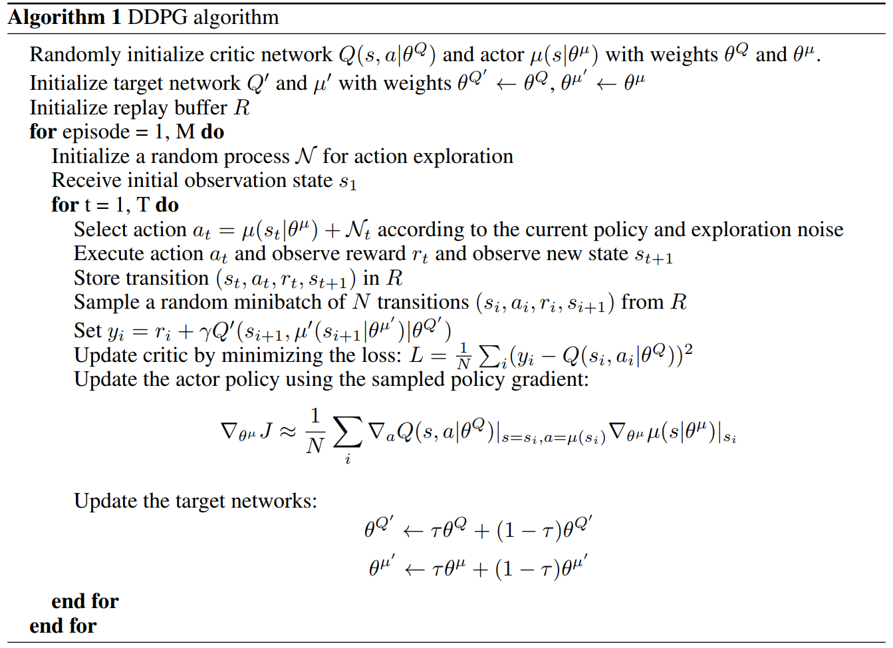
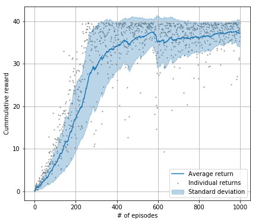
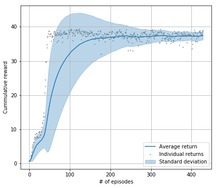

# Project 2: Continuous control 
Deep Reinforcement Learning Nanodegree - Udacity

Iván Vallés Pérez - December 2018

## Introduction
This repository contains an implementation of the [DDPG](https://arxiv.org/abs/1509.02971) algorithm for solving the *Reacher* environment from MLAgents 
(Unity). The task in the environment consists on reaching a moving spatial goal by controling an articulated arm with
4 torques. Reward is given when the target is reached. 

## Environment dynamics
The observation space contains 33 dimensions containing the velocities and position of the arm and the goal to be 
reached. From these variables, the agent has to learn how to control the 4 angular forces applied to the joints of the
arm in order to reach the goal and keep in this position as long as possible.

Two different environment have been provided
- __Single__: a single arm lays in the environment and it has to reach one moving goal
- __Multiple__: it has 20 copies of the same arm with different moving goals. It is intended for training the agent using 
multiple feeds of data, typically leading to a much more fast convergence

This repository solves both kind of environments. Both implementations can be found under the following jupyter 
notebooks: `./notebooks/report_single_ddpg.ipynb` and `./notebooks/report_multiple_ddpg.ipynb`.

The environment is considered to be solved when the average cumulative reward over all the arms and the last 100 episodes is over 30 u.

### Summary
- **Set-up**: Double-jointed arm which can move to target locations.
- **Goal**: The agents must move it's hand to the goal location, and keep it there.
- **Agents**: The environment contains 10 agent linked to a single Brain.
- **Agent Reward Function** (independent): +0.1 Each step agent's hand is in goal location.
- **Brains**: One Brain with the following observation/action space.
- **Vector Observation space**: 26 variables corresponding to position, rotation, velocity, and angular velocities of the two arm Rigidbodies.
- **Vector Action space**: (Continuous) Size of 4, corresponding to torque applicable to two joints.
- **Visual Observations**: None.
- **Reset Parameters**: Two, corresponding to goal size, and goal movement speed.
- **Benchmark Mean Reward**: 30

## Methods
In order to solve the environment, [DDPG](https://arxiv.org/abs/1509.02971) (Deep Deterministic Policy Gradient) algorithm has been used. It is an **actor-critic model-free algorithm** based on the [DPG](http://proceedings.mlr.press/v32/silver14.pdf) (Deterministic Policy Gradient) algorithm that can operate over **continuous action spaces**. The algorithm math details are defined in the jupyter notebooks under the `notebooks`folder.

## Getting Started

### Python set-up
The following libraries are required
- `numpy`
- `unityagents`
- `pytorch`
- `matplotlib`
- `pandas`

### Environment setup
1. Download the environment from one of the links below.  You need only select the environment that matches your operating system:
Single arm
- Linux: [click here](https://s3-us-west-1.amazonaws.com/udacity-drlnd/P2/Reacher/one_agent/Reacher_Linux.zip)
- MacOSX: [click here](https://s3-us-west-1.amazonaws.com/udacity-drlnd/P2/Reacher/one_agent/Reacher.app.zip)
- Windows (32-bit): [click here](https://s3-us-west-1.amazonaws.com/udacity-drlnd/P2/Reacher/one_agent/Reacher_Windows_x86.zip)
- Windows (64-bit): [click here](https://s3-us-west-1.amazonaws.com/udacity-drlnd/P2/Reacher/one_agent/Reacher_Windows_x86_64.zip)

Multiple arms
- Linux: [click here](https://s3-us-west-1.amazonaws.com/udacity-drlnd/P2/Reacher/Reacher_Linux.zip)
- MacOSX: [click here](https://s3-us-west-1.amazonaws.com/udacity-drlnd/P2/Reacher/Reacher.app.zip)
- Windows (32-bit): [click here](https://s3-us-west-1.amazonaws.com/udacity-drlnd/P2/Reacher/Reacher_Windows_x86.zip)
- Windows (64-bit): [click here](https://s3-us-west-1.amazonaws.com/udacity-drlnd/P2/Reacher/Reacher_Windows_x86_64.zip)
    
    (_For Windows users_) Check out [this link](https://support.microsoft.com/en-us/help/827218/how-to-determine-whether-a-computer-is-running-a-32-bit-version-or-64) if you need help with determining if your computer is running a 32-bit version or 64-bit version of the Windows operating system.

    (_For AWS_) If you'd like to train the agent on AWS (and have not [enabled a virtual screen](https://github.com/Unity-Technologies/ml-agents/blob/master/docs/Training-on-Amazon-Web-Service.md)), then please use [this link](https://s3-us-west-1.amazonaws.com/udacity-drlnd/P1/Banana/Banana_Linux_NoVis.zip) to obtain the environment.

2. Place the file in the DRLND GitHub repository, in the `envs` folder, and unzip (or decompress) the file. 

### Instructions to run the agent

Follow the instructions in `./notebooks/report_single_ddpg.ipynb` or `./notebooks/report_multiple_ddpg.ipynb` to get started with training your own agent! This code will invoke the following modules of the project
- `agent.py`: contains a **class for the agent** to orchestrate all the training process of the DDPG algorithm. It will be responsible for collecting samples, interacting with the environment, performing training steps and choosing actions.
- `models.py`: contains a set of **models which will be the brains of the agent**. They are responsible of implementing the technical part of the neural network using pytorch. It will be used by the agent class as an API. It contains **two different models**: one for the *critic* and one for the *actor*
- `rl_utilities`: contains **different functions for helping the agent overcome the necessary tasks** (e.g. experience replay or the cumulative reward plotting function).

### Results
Both, the single and the multiple-arm agents have been solved in this repository. Below, two figures showing the evolution of the cumulative reward are shown.

#### Single-arm environment
The environment is solved in approximately 250 episodes.

#### Multiple-arm environment 
The environment is solved in aproximately 90 episodes.

## Conclusions
The DDPG algorithm stability is **very dependent of the neural network architectures** of the actor and the critic. Batch normalization must be applied carefully, sometimes it can hurt the performance of the whole system and difficult convergence. 

The **multiple-arm environment** shows a **very high improvement in the performance** of the algorithm, it not only converges much faster but the result is much more stable and reliable. The variability of the final agent is much smaller, as can be seen in the figures above.

For the model to work correctly, a very **convenient exploration criterion** has to be defined. In this case, a *Ornstein-Uhlenbeck* process has been used. It leads to a very good result. In order to run the agent without the noise component at test time, the exploration process has been multiplied by an exponential decay over time.

## Next steps
A set of potential improvements have collected and summarized below.
- In order to be able to compare these results with other algorithms, the randomness of the agent and environment must be taken into account. For that, **several experiments with different random seeds must be run**.
- Agent's [**parameters randomization**](https://arxiv.org/abs/1706.01905) is proposed as an exploration system instead of *Ornstein-Uhlenbeck*. It showed promising results in the following paper:
- In order to try to achieve a more natural movement of the arm, a penalty in the movements change is proposed. The biological analogy of it would be the **concept of _laziness_**. Now, the agent does not have any penalty for doing wiggling movements, penalizing high corrections (high accelerations) can potentially lead to more natural movement.
- **[*HER*](https://arxiv.org/abs/1707.01495) algorithm** from OpenAI looks promising. It could lead to an even better performance when solving this task. The nuts and bolts of this algorithm are summarized in the following paper: 
- The currently implemented algorithm should be tested in **other environments**. There is a bunch of different environments in the following repository: [click here](https://github.com/Unity-Technologies/ml-agents/blob/master/docs/Learning-Environment-Examples.md#reacher)

## Contribution
This repository is **totally open to contributions**.  If you find a bug, improvement or just want to extend the documentation or refactor the code, please, feel free to perform a pull request. It will be revised as soon as possible :-).

## License
This repository has been licensed under MIT agreement. 
